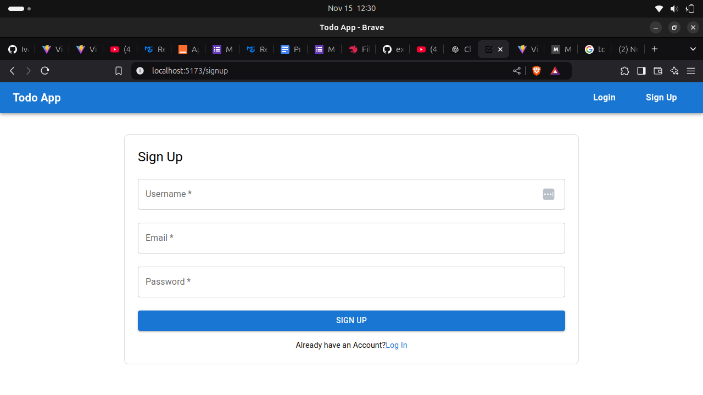
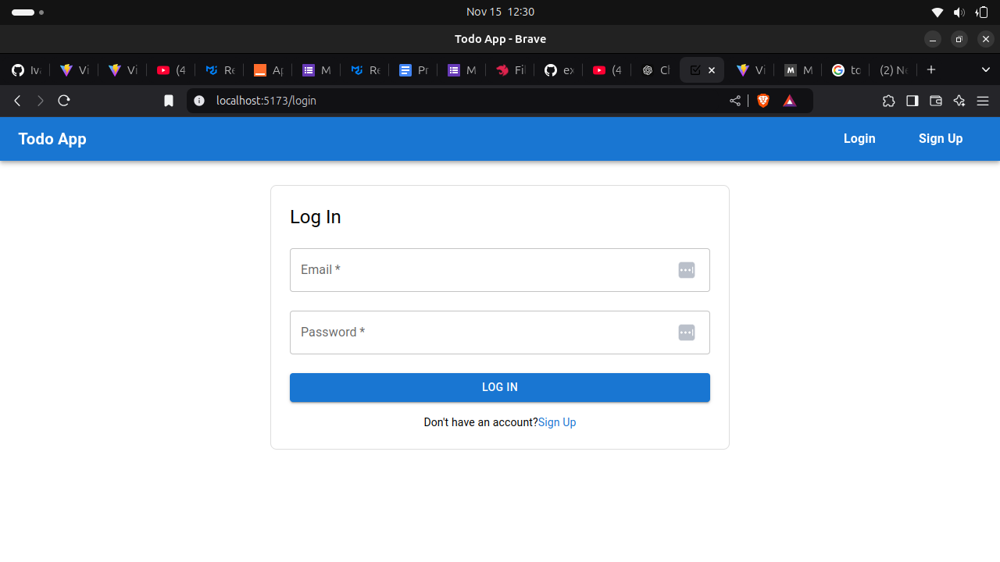
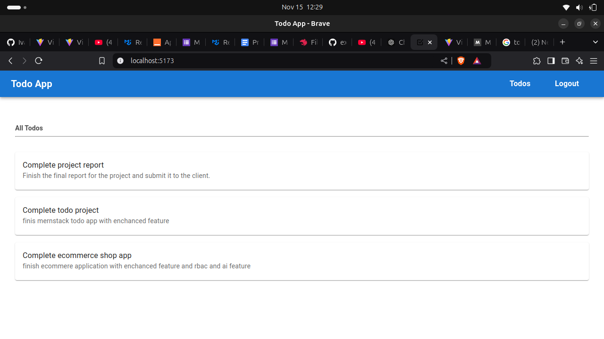
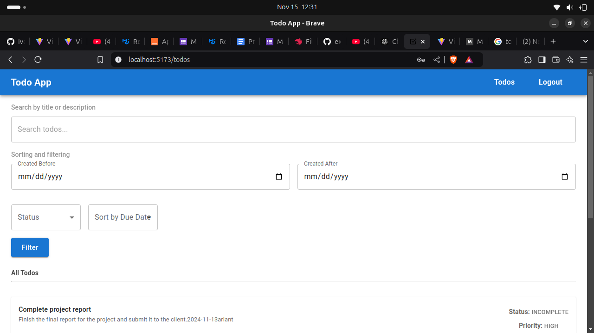
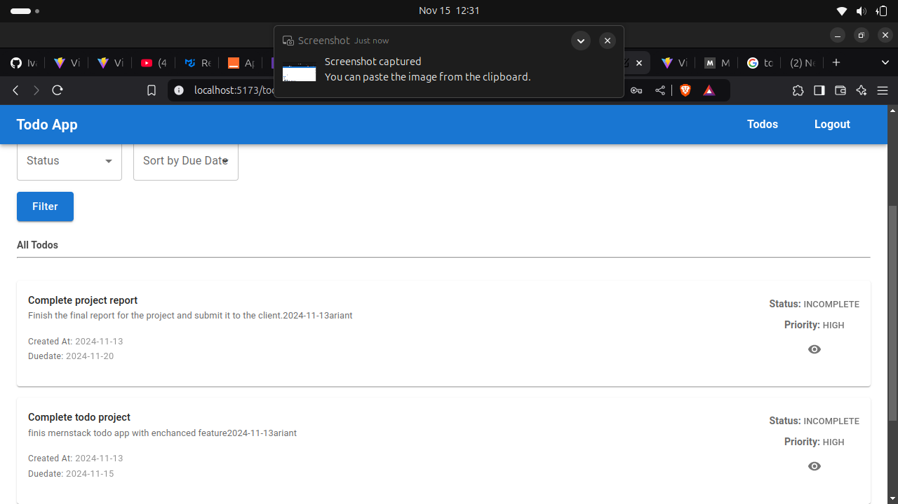

# Todo Frontend Application

A user-friendly Todo application built to manage tasks efficiently. This project features essential functionalities like user authentication, notifications, and advanced task management.

## Features

### Key Functionalities

1. **Login and Registration**
   - User-friendly forms for secure authentication.
2. **User Notifications**
   - Special notifications for first-time logins.
3. **Todo Management**
   - Display a list of todos.
   - Search, filter, and sort todos to manage them effectively.

---

## Getting Started

### Prerequisites

Ensure you have the following installed on your machine:

- **Node.js** (v16+ recommended)
- **npm** or **yarn**

### Setup Instructions

1. **Clone the Repository**
   ```bash
   git clone https://github.com/your-username/todo-frontend.git
   cd todo-frontend/client
   ```
2. **Install all dependency**

   ```bash
   npm install
   ```

3. **Run frontend server**
   ```bash
   npm run dev
   ```

## Screenshots

### Signup Page



### Signup Page



### Home Page



### Todo Page

#### Screenshot 1



#### Screenshot 2


